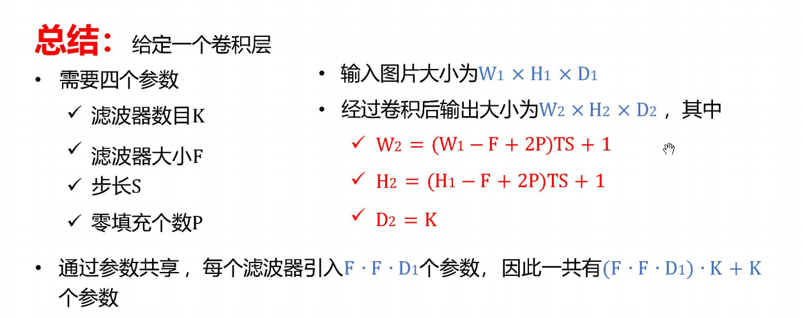

1. **全连接神经网络的缺点：**
（1）全连接前馈神经网络的参数太多，使得网络训练效率过低，且容易过拟合。
（2） 自然图像中的物体通常具有局部不变性的特征，但是全连接网络难以提取这种特征。
2. **CNN的动机（优点）：**
（1）全连接前馈神经网络的参数太多，使得网络训练效率过低，且容易过拟合。卷积层的每个神经元只和下一层某个局部窗口的神经元相连接构成局部神经网络，使得参数变少（局部连接）。
（2）每个神经元通过同一个卷积核去卷积图像，从而减少参数（权重共享）。
（3）卷积网络具有平移不变性，即图像中的目标不管移动到图片哪个位置，经过卷积和池化得到的标签都一致。
3. **卷积神经网络结构上的三个特性：**局部连接，权重共享，池化
4. **权重共享导致的问题和解决办法：** 权值共享会导致只提取了图像一个特征。多加几个滤波器（卷积核）。
5. **高斯滤波器（卷积核所有值相加等于1）**：用来对图像进行平滑去噪。
   **（卷积核所有值相加等于0）**：用来提取图像的边缘特征。
6. **卷积神经网络一般由卷积层，池化层，全连接层**交叉堆叠**组成的前馈神经网络**
（1）卷积层：用于特征提取，具有局部连接，权重共享的特点
（2）池化层：进行特征选择，降低数量从而减少参数，防止过拟合。
      注：池化是指对每个区域进行下采样得到一个值作为这个区域的概括。（平均：抑制邻域值差别过大，对背景保留好；最大：抑制参数误差造成的均值偏移，对纹理提取好。
***

***
7. **卷积神经网络每层的卷积权重是由数据驱动学习而来。**
   **数据驱动卷积神经网络逐层学到由简单到复杂的特征，复杂特征由简单特征组合而来。**
   **多层卷积层的多卷积核的这种组合是一种相对灵活的方式在进行。**
8. **转置卷积：** 也叫反卷积，将低维特征映射到高维特征。$z=wx 变为 x=w^T z$
9. **空洞卷积:**  不增加参数数量，同时增加输出元感受野的方法。可以把它想象成一个“网眼变大”的渔网。渔网上的结点（有参数的权重）没有变多，但是网撒得更开了，一次能覆盖更大的水域。在卷积核每两个元素中间插入D-1个空洞 $K' = K + (K-1)*(D-1)$ 
10. **Lenet：** 提供了利用卷积层堆叠进行特征提取的框架，**开启了深度卷积神经网络的发展**。
11. **Alexnet**：进行了更宽更深的设计，引入dropout，归一化（LAN层），**掀起了深度神经网络在各个领域的研究热潮。**
12. **inceptionnet：** 减少网络参数，降低计算量；多尺度多层次卷积核（1* 1的卷积核可以降维，可以对低层滤波结果组合）
13. **残差网络**：引入残差运算。**优点：** 没有带来额外的参数和计算开销。
14. **RNN的提出动机：** 某些任务需要更好的处理序列信息
15. **RNN的组成**：输入层，隐藏层，循环层（在隐藏层的神经元之间建立权连接），输出层
16. **BPTT**
17. **双向循环神经网络：** 由两次循环神经网络组成，输入相同，信息传递方向不同。
18. LSTM和GRU的提出动机：解决长程依赖问题（当序列变得很长时，模型很难把“很久以前”的信息，准确地传递和应用到“当下”的计算中）和梯度消失问题。
19. LSTM和GRU的区别：
（1）LSTM有三个门函数，输入门，遗忘门，输出门分别控制输入值，记忆值，输出值。
     GRU只有两个门函数，更新门和重置门，
（2）LSTM有两个状态：细胞状态和隐藏状态，GRU将细胞状态和输出状态合并为一个状态，只有隐藏状态。
（3）GRU的参数量更少，结构更简单。
20. **无监督学习**：指从无标签的数据中学习一些有用的模式（特征，类别，结构，概率分布等）
21. **Hopfield神经网络是一种单层互相全连接的反馈神经网络**
     特点：单元之间连接权值对称；
          每个单元没有到自身的权重；
          每次只有一个单元的状态发生改变（随机异步更新）；
          n个二值单元做成的二值神经网络，每个单元的输出和输入只能是1或0；
          单元的状态会一直变换直到网络达到稳定。
22. **自编码器是一种有效的数据维度压缩算法，主要应用于：
         （1）构建一种能够重构输入样本并进行特征表达的神经网络。
         （2)  训练多层神经网络时候，通过自编码器训练样本得到参数初始值。**
23. **自编码器是一种基于无监督学习的神经网络，目的在于经过不断调整参数，重构经过维度压缩的输入样本。由输入层，中间层，重构层三层神经网络组成。**
24. **降噪自编码器**：神经网络能够消除样本中的噪声。
25. **稀疏自编码器**：通过增加正则化项，大部分单元输出为0，从而利用少数单元完成压缩或重构，去除冗余信息。
26. **自底向上的注意力**：注意力的引起完全是由外部刺激的物理属性（如颜色突变、方向突变）决定的，不需要任何先验知识或主观意图的参与。（下图1，直接看可以注意到不一样得红条）
27. **自顶向下的注意力**：仅仅靠单纯的像素物理刺激，只能看到一堆碎斑块，无法拼凑出物体，必须动用大脑中关于“狗的轮廓、形态”的先验知识和经验（Top），主动向下对这些碎斑块进行组合、解释和过滤。（下图2，直接看看不出来是啥东西，告知里面有个人后就可以用这个先验知识来将注意集中到这个人）

28. **打分函数**
$$
\begin{aligned}
\text{加性模型} \quad & s(\mathbf{x}, \mathbf{q}) = \mathbf{v}^\top \tanh(\mathbf{W}\mathbf{x} + \mathbf{U}\mathbf{q}), \\
\text{点积模型} \quad & s(\mathbf{x}, \mathbf{q}) = \mathbf{x}^\top \mathbf{q}, \\
\text{缩放点积模型} \quad & s(\mathbf{x}, \mathbf{q}) = \frac{\mathbf{x}^\top \mathbf{q}}{\sqrt{D}}, \\
\text{双线性模型} \quad & s(\mathbf{x}, \mathbf{q}) = \mathbf{x}^\top \mathbf{W}\mathbf{q},
\end{aligned}
$$

29. **键值对注意力**
$$
\begin{aligned}
\operatorname{att}(\mathbf{K}, \mathbf{V}, \mathbf{q}) &= \sum_{n=1}^{N} \alpha_n \mathbf{v}_n \\
&= \sum_{n=1}^{N} \frac{\exp(s(\mathbf{k}_n, \mathbf{q}))}{\sum_{j} \exp(s(\mathbf{k}_j, \mathbf{q}))} \mathbf{v}_n
\end{aligned}
$$

 30. **QKV**
 31. **多头注意力**：把高维的 $Q, K, V$ 拆切成多组低维的子向量，让它们在各自独立的特征空间里并行计算注意力，最后把各组的输出拼接还原并做一次融合
多头注意力机制核心公式$$ \operatorname{MultiHead}(\mathbf{Q}, \mathbf{K}, \mathbf{V}) = \operatorname{Concat}(\text{head}_1, \text{head}_2, \dots, \text{head}_H)\mathbf{W}^O $$ 其中每个头 $\text{head}_i$ 独立并行计算： $$ \text{head}_i = \operatorname{Attention}(\mathbf{Q}\mathbf{W}_i^Q, \mathbf{K}\mathbf{W}_i^K, \mathbf{V}\mathbf{W}_i^V) = \operatorname{softmax}\left( \frac{(\mathbf{Q}\mathbf{W}_i^Q)(\mathbf{K}\mathbf{W}_i^K)^\top}{\sqrt{D_k}} \right)(\mathbf{V}\mathbf{W}_i^V) $$
32. **生成对抗网络**：
        生成网络：输入为从潜在空间随机采样，其输出结果要尽量模仿训练集的真实样本。
        判别网络：输入为真实样本，生成网络输出的假样本，其目的是尽可能分辨出真实样本                     和假样本。

33. **强化学习**：智能体不断与环境进行交互，并根据经验调整其策略来最大化其长远的所有奖励的累计值。
34. 深度强化学习是将强化学习和深度学习结合在一起，用强化学习来定义问题和优化目标，用深度学习来解决状态表示、策略表示等问题。（RL是灵魂，DL是肉体）
35. $$
\begin{array}{|c|c|c|}
\hline
\textbf{对比维度} & \textbf{卷积神经网络 (CNN)} & \textbf{图神经网络 (GNN)} \\ \hline
\textbf{典型输入} & 图像、视频、音频（Matrix/Tensor） & 社交网络、分子结构、知识图谱（Graph: V, E） \\ \hline
\textbf{邻居节点数} & \text{静态、固定} & \text{动态、不固定（度数 Degree 每个人都不同）} \\ \hline
\textbf{核心算子} & \text{局部矩阵点乘求和} & \text{消息传递、邻居聚合（如 GCN, GAT）} \\ \hline
\textbf{计算位置依赖} & \text{强烈依赖空间相对位置（上下左右）} & \text{不依赖绝对空间位置，只依赖连接拓扑关系} \\ \hline
\textbf{参数量与规模} & \text{权重共享，通常与输入图像大小解耦} & \text{随着节点和边的暴增，大规模并行和显存优化极具挑战} \\ \hline
\end{array}
$$
36. **对于给定的数据，选择什么网络来处理：**
     选 **CNN** 还是 **GNN**？就看你怎么看待数据：如果数据各部分的位置是**钉死的、整齐的矩阵**（如照片像素），选 **CNN**；如果数据的精髓在于“谁和谁连在一起”且错综复杂（如社交网络、化学键、概念网络），选 **GNN**。
37. 深度学习有啥局限性
        （1）算法输出不稳定，容易被攻击。
        （2）模型复杂度高，难以纠错和调试
        （3）模型层级复合程度高，参数不透明
        （4）端到端训练方式对数据依赖性强，模型增量差
        （5）专注直观感受类问题，对开放性推理问题无能为力
        （6）人类知识无法引入进行有效监督，机器偏见难以避免
38. **（建议自己看看）LIF，HH模型，lzh模型，SRM模型优缺点**
        （1）LIF模型：具有三大特征：欧姆漏电流（Leaky）、电容积累（Integrate）、阈值                            激发（Fire）。电位不仅随输入而上升，还会随时间自然向静息电位衰                             减。
                缺点：能很好解释发放过程，但是无法解释神经元的适应，爆发等过程（生物            精确性低）。
        （2）HH模型：可以分析动作电位的形成过程，可以描述不应期，可以复现阻尼振荡和                           瞬态脉冲
                缺点：计算量过大，复杂度高
        （3）lzh模型：计算量小且具有生物学上的合理性
        （4）SRM模型：复杂度较低，生物精确性较高
39. 对比SNN和传统神经网络的区别（感觉这个问题的答案是下面一点）
（1）采用脉冲编码，可以获得更多的信息和更强的计算能力，脉冲神经元是比传统神经元更强大的计算单元。
（2）传统神经网络的基本操作只能作用于有限的比特数，而脉冲神经网络的序列存储于相位中，因此基本操作可以改变整个序列。
（3）在神经元数目相同的情况下，脉冲神经网络至少具有传统神经网络的计算能力；脉冲神经网络可以以任意精度拟合任意复杂函数；相比传统神经网络，脉冲神经网络可以通过更少的神经元达到相同计算能力。
40. 对比SNN和传统神经网络的区别，SNN的潜在优势（深入理解）
（1）脉冲神经网络采用离散脉冲传递，传统神经网络采用连续值传递
（2） **不同神经元非线性信息处理模式的差异**：SNN具有数多类少的兴奋性神经元和数少类多的抑制性神经元
（3） **神经元节点对时间-空间信息的高效整合能力**：膜电位是多个高阶吸引子的动态组合，可塑性强   
（4）.**稀疏的神经信息/神经脉冲编码方式**：传统ANN中，无论输入什么，所有神经元都要同时参与计算。而SNN是有脉冲才计算，在没有外部事件时，硬件单元完全处于静默状态。降低后期运算量、信息传递能耗
（5） **神经元中突触的位置差异性建模**：SNN引入树突计算，提升了单个节点得表达容量。
（6）**神经元突触的信息延迟建模**：增强SNN时间动态编码能力
（7） **快速的、非监督的微观神经突触可塑性调节方法**：
（8）**介观尺度生物微环路的多时钟自组织调节**：SNN采用内部时间关联建模，ANN 全局采用统一的时钟步长同步更新。
（9）**宏观生物网络多脑区的协同能力**：SNN具有兴奋/抑制连接通路、多种神经反馈信息