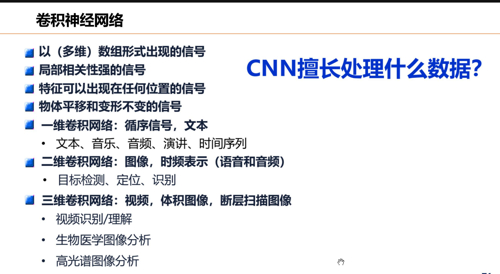

1. **全连接神经网络的缺点：**
（1）全连接前馈神经网络的参数太多，使得网络训练效率过低，且容易过拟合。
（2） 自然图像中的物体通常具有局部不变性的特征，但是全连接网络难以提取这种特征。
2. **CNN的动机（优点）：**
（1）全连接前馈神经网络的参数太多，使得网络训练效率过低，且容易过拟合。卷积层的每个神经元只和下一层某个局部窗口的神经元相连接构成局部神经网络，使得参数变少（局部连接）。
（2）每个神经元通过同一个卷积核去卷积图像，从而减少参数（权重共享）。
（3）卷积网络具有平移不变性，即图像中的目标不管移动到图片哪个位置，经过卷积和池化得到的标签都一致。
3. **卷积神经网络结构上的三个特性：**局部连接，权重共享，池化
4. **权重共享导致的问题和解决办法：** 权值共享会导致只提取了图像一个特征。多加几个滤波器（卷积核）。
5. **高斯滤波器（卷积核所有值相加等于1）**：用来对图像进行平滑去噪。
   **（卷积核所有值相加等于0）**：用来提取图像的边缘特征。
6. **卷积神经网络一般由卷积层，池化层，全连接层**交叉堆叠**组成的前馈神经网络**
（1）卷积层：用于特征提取，具有局部连接，权重共享的特点
（2）池化层：进行特征选择，降低数量从而减少参数，防止过拟合。
      注：池化是指对每个区域进行下采样得到一个值作为这个区域的概括。（平均：抑制邻域值差别过大，对背景保留好；最大：抑制参数误差造成的均值偏移，对纹理提取好。
***
    
***
7. **卷积神经网络每层的卷积权重是由数据驱动学习而来。**
   **数据驱动卷积神经网络逐层学到由简单到复杂的特征，复杂特征由简单特征组合而来。**
   **多层卷积层的多卷积核的这种组合是一种相对灵活的方式在进行。**
8. **转置卷积：** 也叫反卷积，将低维特征映射到高维特征。$z=wx 变为 x=w^T z$
9. **空洞卷积:**  不增加参数数量，同时增加输出元感受野的方法。可以把它想象成一个“网眼变大”的渔网。渔网上的结点（有参数的权重）没有变多，但是网撒得更开了，一次能覆盖更大的水域。在卷积核每两个元素中间插入D-1个空洞 $K' = K + (K-1)*(D-1)$ 
10. **Lenet：** 提供了利用卷积层堆叠进行特征提取的框架，**开启了深度卷积神经网络的发展**。
11. **Alexnet**：进行了更宽更深的设计，引入dropout，归一化（LAN层），**掀起了深度神经网络在各个领域的研究热潮。**
12. **inceptionnet：** 减少网络参数，降低计算量；多尺度多层次卷积核（1* 1的卷积核可以降维，可以对低层滤波结果组合）
13. **残差网络**：引入残差运算。**优点：** 没有带来额外的参数和计算开销。
14. **RNN的提出动机：** 某些任务需要更好的处理序列信息
15. **RNN的组成**：输入层，隐藏层，循环层（在隐藏层的神经元之间建立权连接），输出层
16. **BPTT**
17. **双向循环神经网络：** 由两次循环神经网络组成，输入相同，信息传递方向不同。
18. LSTM和GRU的提出动机：解决长程依赖问题（当序列变得很长时，模型很难把“很久以前”的信息，准确地传递和应用到“当下”的计算中）和梯度消失问题。
19. LSTM和GRU的区别：
（1）LSTM有三个门函数，输入门，遗忘门，输出门分别控制输入值，记忆值，输出值。
     GRU只有两个门函数，更新门和重置门，
（2）LSTM有两个状态：细胞状态和隐藏状态，GRU将细胞状态和输出状态合并为一个状态，只有隐藏状态。
（3）GRU的参数量更少，结构更简单。
20. 
无监督学习
10.1，10.6，10.7 自编码器（重点，提的多）
自底（顶）向上（下）的注意力（给例子看看它是哪种）（第六讲其他大概率不管）

打分函数，键值对，QKV
多头注意力
11.2过的很快（生成对抗网络看看）
强化学习定义
深度强化学习P40，结合起来的优点是啥。（RL是灵魂，DL是肉体）
11.4原理理解（给一些数据，会问你用什么网络比较适合处理）（卷积神经网络和图神经网络的区别，对比，适合处理什么数据）

11.5 深度学习有啥局限性
LIF，HH模型，lzh模型，SRM模型都看看是啥东西（理解优缺点）
对比SNN和传统神经网络的区别（为啥低功耗）有啥优势，潜力（深入解释）