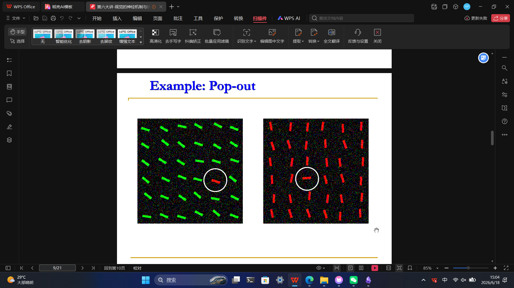
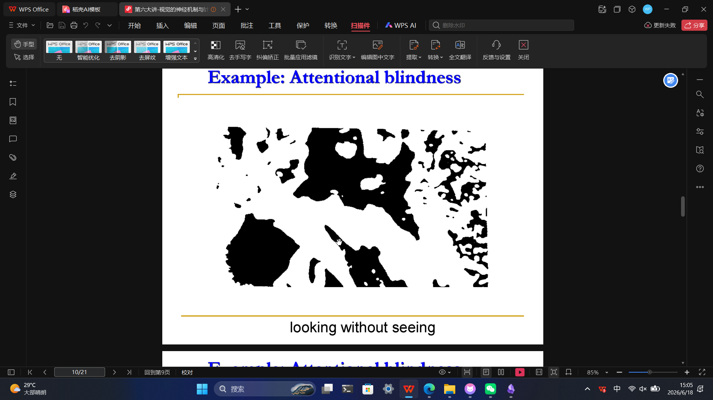

卷积神经网络结构上的三个特性，卷积神经网络的优点。
不同的滤波器有啥用处。
卷积的动机，权值共享的后果和解决办法
CNN三个层及其作用
转置卷积，空洞卷积
Lenet，Alexnet，inceptionnet，残差网络
RNN的提出动机和组成
BPTT(重点)
双向循环神经网络
LSTM和GRU的提出动机，重点区别
9.4没提到
无监督学习
10.1，10.6，10.7 自编码器（重点，提的多）
自底（顶）向上（下）的注意力（给例子看看它是哪种）（第六讲其他大概率不管）

打分函数，键值对，QKV
多头注意力
11.2过的很快（生成对抗网络看看）
强化学习定义
深度强化学习P40，结合起来的优点是啥。（RL是灵魂，DL是肉体）
11.4原理理解（给一些数据，会问你用什么网络比较适合处理）（卷积神经网络和图神经网络的区别，对比，适合处理什么数据）
11.5 深度学习有啥局限性
LIF，HH模型，lzh模型.....都看看是啥东西（理解优缺点）
对比SNN和传统神经网络的区别（为啥低功耗）有啥优势，潜力（深入解释）

