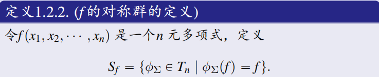
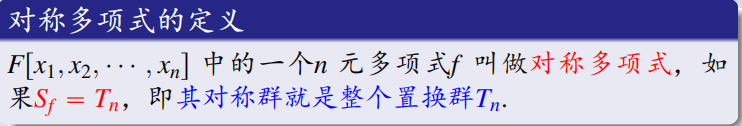
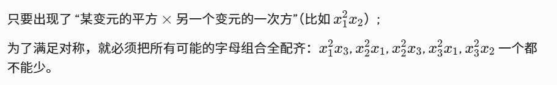

***
# 注意

1. **对于矩阵A，$\det(A)=\lambda_1\lambda_2\cdots\lambda_n$.**
2. **正交矩阵的特征值只有1和-1.**
3. 设 $A$ 和 $B$ 是两个**有限集合**，并且它们的元素个数相等（即 $|A| = |B|$）。 如果映射 $f: A \to B$ 是**单射**，那么 $f$ 必然也是**满射**（从而 $f$ 是双射）。
4. $(s,n) = us + vn,\exists u,v \in Z$
5. 带余除法 ：$m = nq +r , r = 0 或 r < n$
6. 核空间是G的正规子群

7. 验证子群时还需要验证非空
8. 证明两个集合相等，大概率证明左包含右且右包含左。
9. 证明一个集合是另一个群的正规子群时，除了验证正规性还要验证子群。
10. 若 $|G| = n$，则对任意 $g \in G$ 有 $g^n = e$
11. [拉格朗日定理](近世代数第二章.md#2.3.12%20拉格朗日定理)：子群的阶整除群的阶
12. 证明两个左陪集相等$aH = bH \iff a^{-1}b \in H$
13. 裴属定理：
    对于任意两个整数 $a$ 和 $b$，关于未知数 $u$ 和 $v$ 的线性丢番图方程：

$$ua + vb = d$$

当且仅当 $d$ 是 $a$ 和 $b$ 的**最大公约数**（即 $d = \gcd(a, b)$）的倍数时，该方程才有整数解。
14. 证明一个集合是理想时候请证明ar ，ra都属于I。
15. 整环需要证明加法和乘法都满足交换律（它是交换环），再证明无零因子。
16. 无零因子除了$\forall a, b \in R, \quad a \cdot b = 0 \implies a = 0 或 b = 0$还有$\text{对任意 } a, b \in R, \text{ 若 } a \neq 0 \text{ 且 } b \neq 0, \text{ 则 } ab \neq 0$.
17. 素理想和极大理想都是R的真理想，且R需要为含1交换环。
18. 
***
# 1.1.1 变换的定义

 **设M是任意一个非空集合，M的变换是指M到自身的一个对应。M的一一变换是指M到自身上的一一对应（双射）。**
***

# 1.1.2 运动的定义

***
# 1.1.3 四种平面等距变换

### 1.1.3.1 平移、旋转
**（保向等距变换（图形的左右手性不发生变换））**

### 1.1.3.2 反射（翻折）
**（反向等距变换）**
**关于直线 $l$  反射，则直线 $l$ 上的点都是不动点。**
 
### 1.1.3.3 滑移反射
**（反向等距变换）**
**滑移反射就是先关于 $l$ 反射以后再沿着 $l$  平移。**

注：1.平面上的所有等距变换一定是这四种中的一个。 
    2.等距变换就是运动。
     
***
# 定理 1.1.4 

***
# 1.1.5 变换群的定义

**（变换的乘法指变换的复合）**

***
# 1.1.6 运动群的定义

 设 $M(\mathbb{R}^2)$ 表示二维平面的所有运动。
 由于运动是保距的一一变换，故 $M(\mathbb{R}^2)\subseteq T(\mathbb{R}^2)$ 。

1. **易证得两个运动的乘积还是运动（从双射与双射的复合还是双射和两个等距的复合还是等距来证明）（封闭性）**
2. **运动的逆变换还是运动（逆元存在）**
3. **恒等变换是一个运动（单位元存在）**
故$(M(\mathbb{R}^2), \circ)$ 是二维平面的一个运动群，运动群是变换群的子群。

***
# 1.1.7 对称群的定义

使平面图形 $K$ 仍回到自身的平面运动的全体， 记作$S(K)$，且这些运动只会是反射和滑移反射。
$(S(K), \circ)$ 满足闭结幺逆，故称其为平面图形 $K$ 的对称群。

***
# 1.1.8 n元对称群的定义

***

# 1.2.1 n元多项式$F[X]$ 的置换群

$$\phi_{\theta}(f) = f(x_{\theta(1)}, x_{\theta(2)}, \dots, x_{\theta(n)})$$
**易验证$(T_{n},\circ)$满足闭结幺逆，称为$F[X]$的置换群。**

***
# 1.2.2 n元多项式$f(x_{1},x_{2},\dots,x_{n})$的对称群

注：
1. **$f$ 的对称群就是满足将f置换后的多项式还是 $f$  的置换全体。**
2. $(S_{f},\circ)$ 是$(T_{n},\circ)$ 的子群。
***

# 1.2.3 对称多项式的定义

对称多项式并不是所有$x_{i}$ 的次数都相同，而是

***

