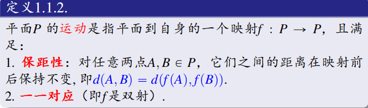
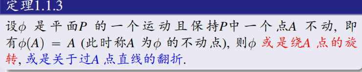
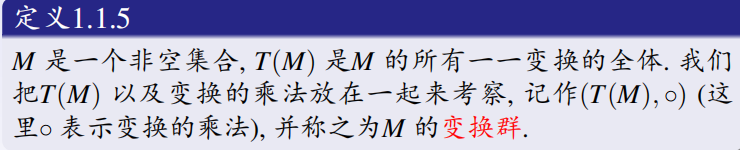
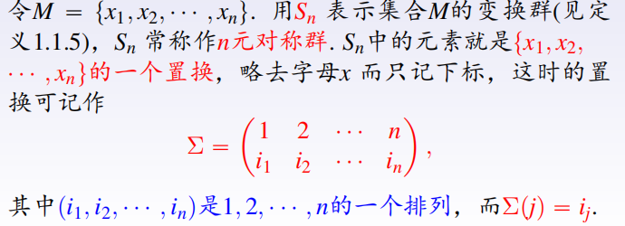
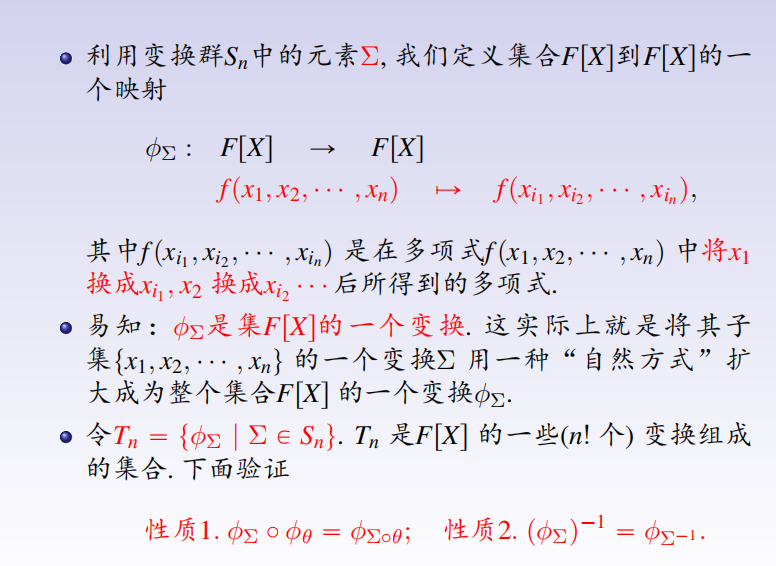

***
# 1.1.1 变换的定义

 **设M是任意一个非空集合，M的变换是指M到自身的一个对应。M的一一变换是指M到自身上的一一对应（双射）。**
***

# 1.1.2 运动的定义

***
# 1.1.3 四种平面等距变换

### 1.1.3.1 平移、旋转
**（保向等距变换（图形的左右手性不发生变换））**

### 1.1.3.2 反射（翻折）
**（反向等距变换）**
**关于直线 $l$  反射，则直线 $l$ 上的点都是不动点。**
 
### 1.1.3.3 滑移反射
**（反向等距变换）**
**滑移反射就是先关于 $l$ 反射以后再沿着 $l$  平移。**

注：1.平面上的所以等距变换一定是这四种中的一个。 
    2.等距变换就是运动。
     
***
# 定理 1.1.4 

***
# 1.1.5 变换群的定义

**（变换的乘法指变换的复合）**

***
# 1.1.6 运动群的定义

 设 $M(\mathbb{R}^2)$ 表示二维平面的所有运动。
 由于运动是保距的一一变换，故 $M(\mathbb{R}^2)\subseteq T(\mathbb{R}^2)$ 。

1. **易证得两个运动的乘积还是运动（从双射与双射的复合还是双射和两个等距的复合还是等距来证明）（封闭性）**
2. **运动的逆变换还是运动（逆元存在）**
3. **恒等变换是一个运动（单位元存在）**
故$(M(\mathbb{R}^2), \circ)$ 是二维平面的一个运动群。

***
# 1.1.7 对称群的定义

使平面图形 $K$ 仍回到自身的平面运动的全体， 记作$S(K)$.
$(S(K), \circ)$ 满足闭结幺逆，故称其为平面图形 $K$ 的对称群。

***
# 1.1.8 n元对称群的定义

***

# 1.2.1 n元多项式$F[X]$ 的置换群

$$\phi_{\theta}(f) = f(x_{\theta(1)}, x_{\theta(2)}, \dots, x_{\theta(n)})$$
**易验证$(T{n},\circ)$满足闭结幺逆，称为$F[X]$的置换群。**

***
