# 第二章 群
***

## 2.1.1 半群的定义（闭结）
  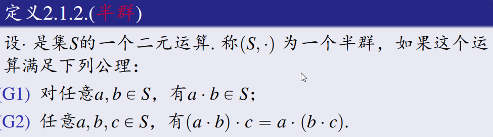
 ***
## 2.1.2 群的定义（闭结幺逆）

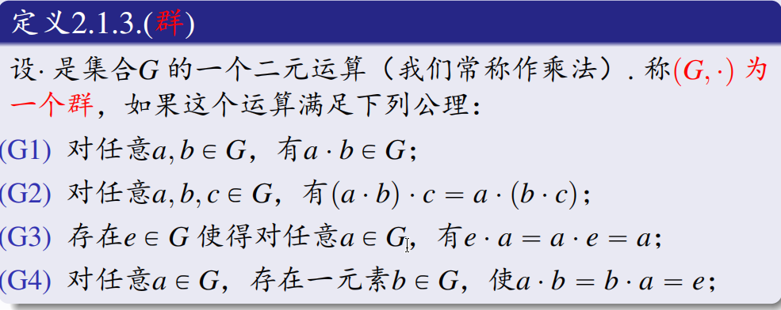
**注意：**
1. **证明是单位元和逆元需要同时证明 $e \cdot a = a \cdot e = a;$ $b \cdot a = a \cdot b = e;$左乘右乘都需要。**
2. **单位元与逆元唯一。**
3. **有些群需要先验证单位元是否属于该群。**

***
## 2.1.3 交换群（阿贝尔群）的定义

 1. **群的定义**
 2. **对任意a，b属于G，a.b = b.a 。** 
***
## 2.1.4 群的阶的定义

**群的阶指群G元素的个数，记作|G|。**
***
## 2.1.5 群同构的定义

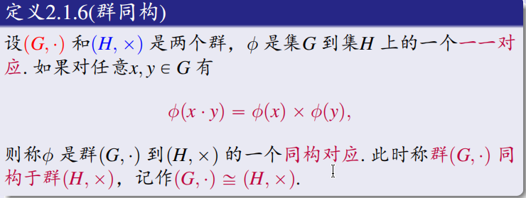
**注意：**
1. **群同构 = 双射 + 保持运算**
2. 单同态 = 单射 + 保持运算
3. 满同态 = 满射 + 保持运算
4. 群同态 = 保持运算

***
## 2.1.6 群的自同构$Aut(G)$

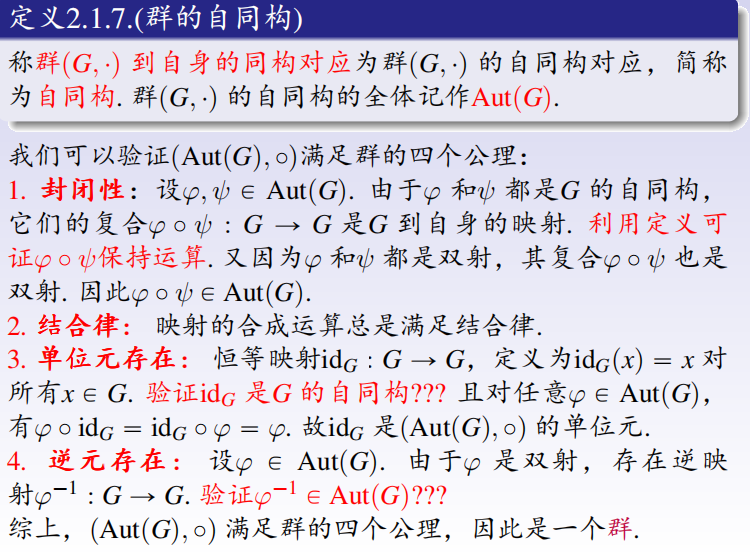
***
## 2.1.7 反同构

**群同构需要满足的保持运算为$\phi(x \cdot y) = \phi(x) \times \phi(y)$,**
**反同构需要满足的保持运算为$\phi(x \cdot y) = \phi(y) \times \phi(x)$。**

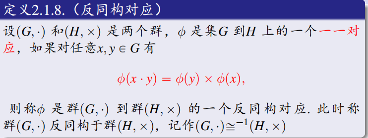
***
***
## 2.2.1 元素阶的定义

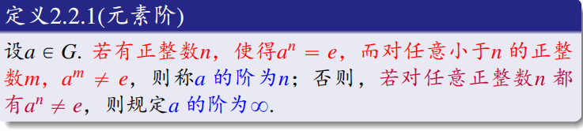
注意：**元素a的阶不是满足 $a^n = e$ 的n，还需要满足 $a^m\neq e$ 对所有小于n的m都成立。**
***
## 2.2.2 中心元的定义

中心元就是群里面对所有元素可交换的元素。
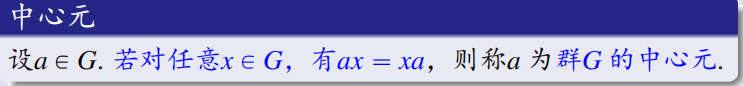

**易知，**
1. **$e$  是中心元；**
2. **如果 $a$  是中心元，$a^{-1}$  也是中心元（$a^{-1}x = a^{-1}xe = a^{-1}xaa^{-1}$）。**
***
## 2.2.3 子群的定义

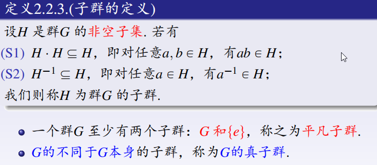

==注：验证一个子集加上运算规则是子群，只需要证明满足封闭性和逆元存在（结合律自动继承大群，单位元在满足上述两个条件下自动成立。）==
***
## 2.2.4 子群的并一般不是子群

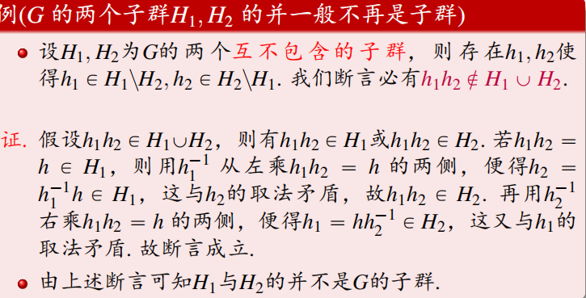

***
## 2.2.5 子群的交一定是子群

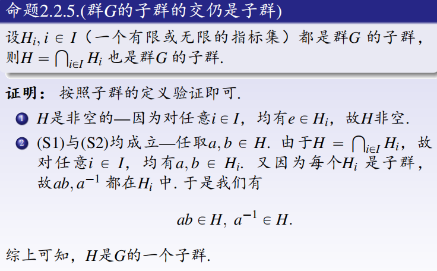

***
## 2.2.6 包含M的最小子群

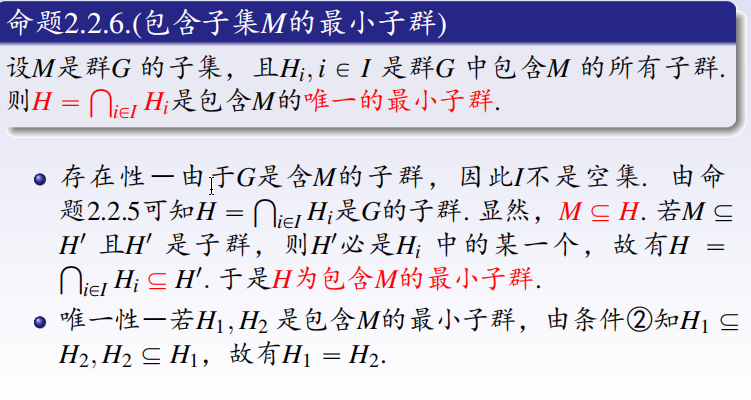
1. 如果M是子群，则显然 H = M
2. 如果M是空集，则H = {e}
3. 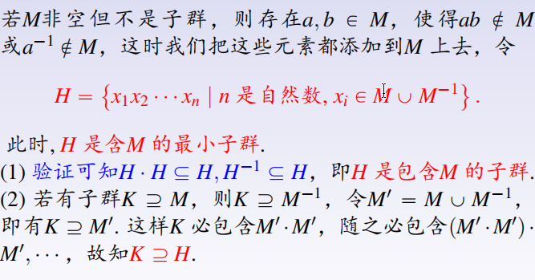
***
## 2.2.7 生成子群和生成元集

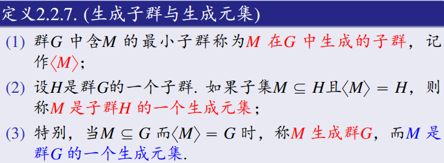
**注：如果M只有一个元素，这个生成子群又叫循环子群。**

***
## 2.2.8 群的中心

1. 群的中心就是群G所有中心元共同构成的子群C（验证封闭性和逆元也属于子群）。
2. 子群C在群G的任意自同构$\phi$下是不变的，即$\phi C = C.$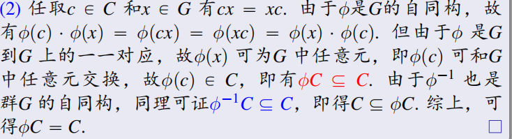
***
## 2.2.9 内自同构

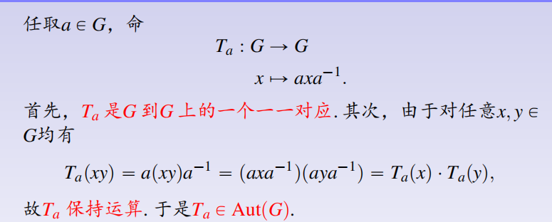
**令 $\text{Inn}(G) = \{T_a \mid a \in G\}$**
**可验证$\text{Inn}(G)$是$\text{Aut}(G)$的一个正规子群**。
称$\text{Inn}(G)$为群G的内自同构群。

注：
1. $T_e = I$。
2. 对于任意的中心元c，$T_c = I$。
***

## 2.2.10 正规子群的定义

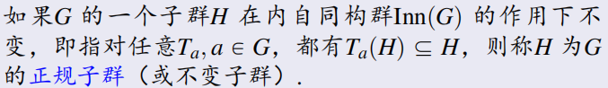
**注：这里$T_a(H) \subseteq H$与$T_a(H) = H$等价。（即需要验证$H \subseteq T_a(H)$，考虑$T_{a^{-1}}(H)\subseteq H$)。**

则正规子群还等价于$$\forall a \in G, \quad aH = Ha.$$
子群H是正规子群当且仅当H和G的任意子集M相乘时可交换。
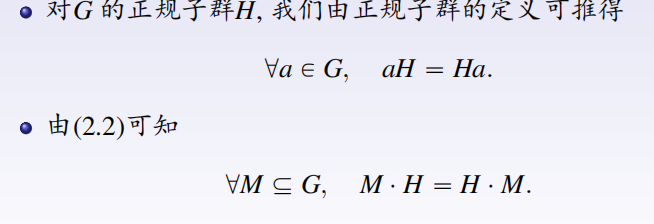
***
