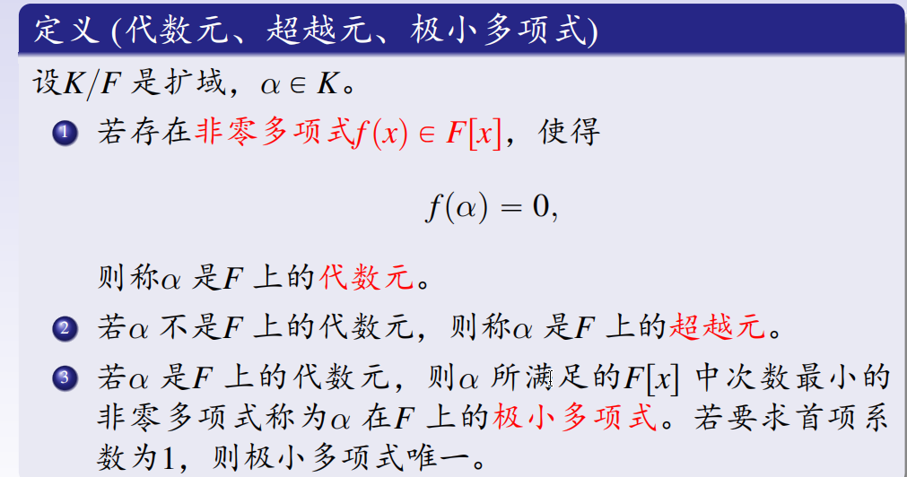

# 域的理想

***

***
# 子域的定义

***
# 扩域的定义

***
# 中间域的性质

***
# 有限生成扩域

***
# 扩域次数的定义

***
# 次数乘法公式

***
# 代数元的定义
大域里的一个数字 $\alpha$，如果能用小域里的系数通过多项式方程“解”出来，它就是代数元，它对应的那个最精简的方程就叫极小多项式；如果无论如何都解不出来，它就是超越元。

***
# 