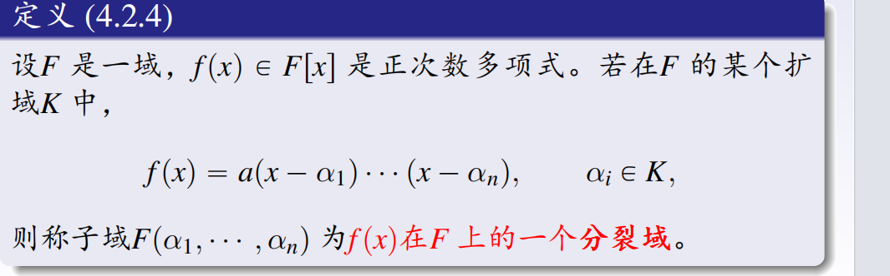
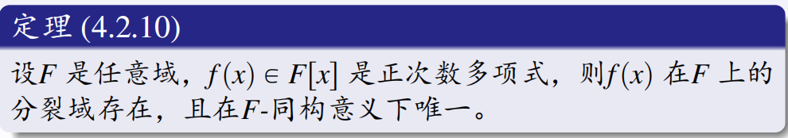

# 域的理想

***

***
# 子域的定义

***
# 扩域的定义

***
# 中间域的性质

***
# 有限生成扩域

***
# 扩域次数的定义

***
# 次数乘法公式

***
# 代数元的定义
大域里的一个数字 $\alpha$，如果能用小域里的系数通过多项式方程“解”出来，它就是代数元，它对应的那个最精简的方程就叫极小多项式；如果无论如何都解不出来，它就是超越元。

***
# 极小多项式是不可约多项式

***
# 有限次扩域是代数扩域（K的元素都是F上的代数元）

***
# 单扩域
向一个域 $F$ 中添加一个代数元 $\alpha$”后，新产生的单扩域 $F(\alpha)$
满足$K = F(\alpha) \cong F[x]/(p(x))$
若极小多项式 $p(x)$ 的次数 $\deg p(x) = n$，
则$[F(\alpha) : F] = n$
只要在域 $F$ 上给出一个不可约多项式 $p(x)$，就必定存在一个单扩域 $K = F(\alpha)$，使得 $\alpha$ 是 $p(x)$ 的根。
***
# 分裂域的定义

***
# 分裂域的存在唯一

