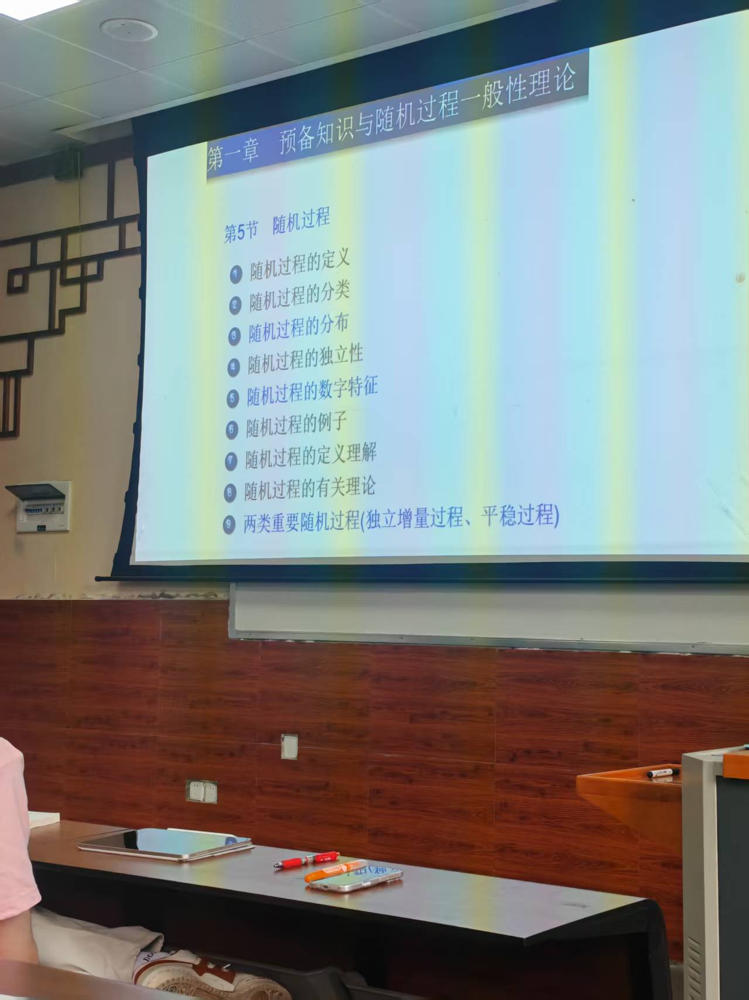
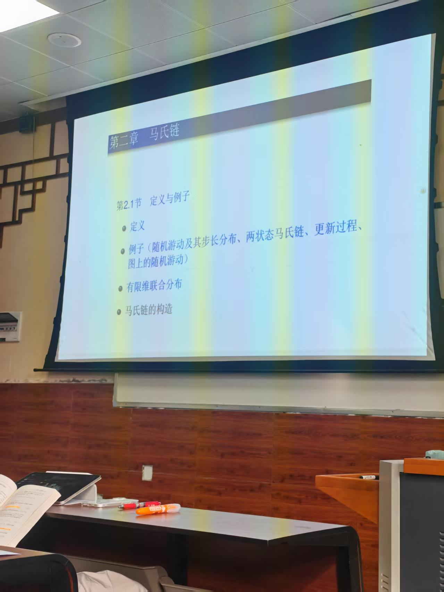
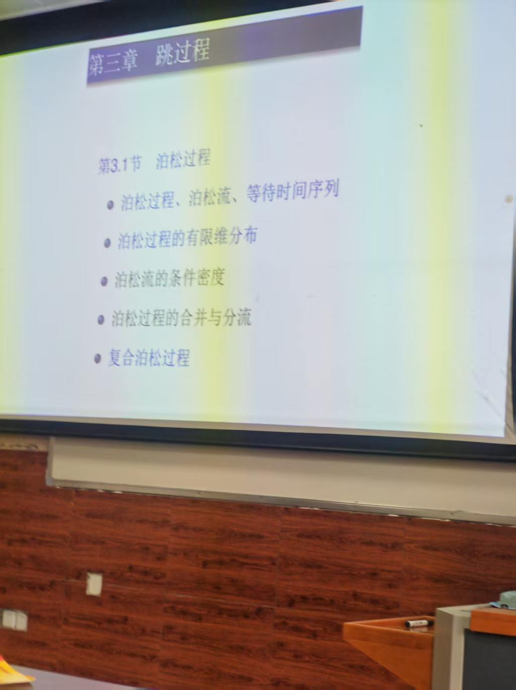
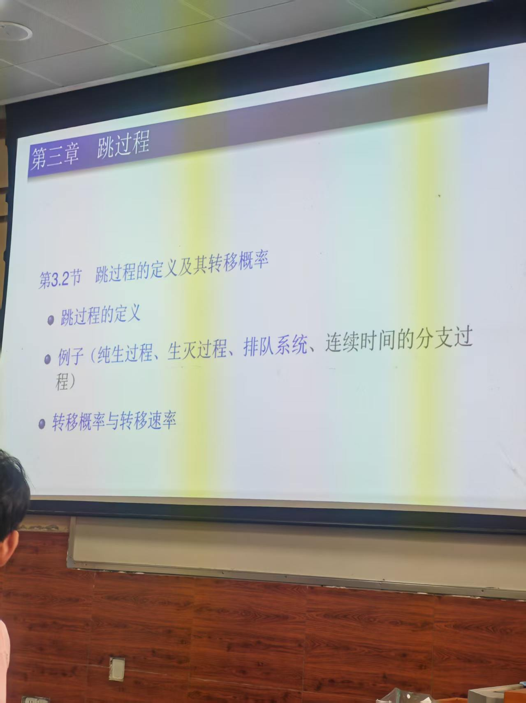

考试题型：
1.名词解释。
2-8：第一章第四章第五章（说明鞅）一道，第二章和第三章都是两道。
- [[随机过程/随机过程第一章]]：分布，数字特征，独立增量过程，平稳过程
- [[随机过程/随机过程第二章]]：马氏链的定义，例子（...),有限维联合分布；
不变分布（可逆分布），状态分类，
- [[随机过程/随机过程第三章]]：见下图（纯生过程，生灭过程，排队系统）
- [[随机过程/随机过程第四章]]：判断一个过程是标准布朗运动

强马氏性补充知识
P124补充知识
格林函数
