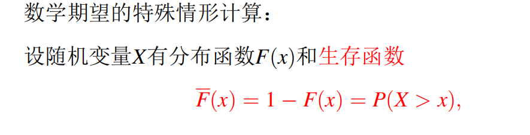
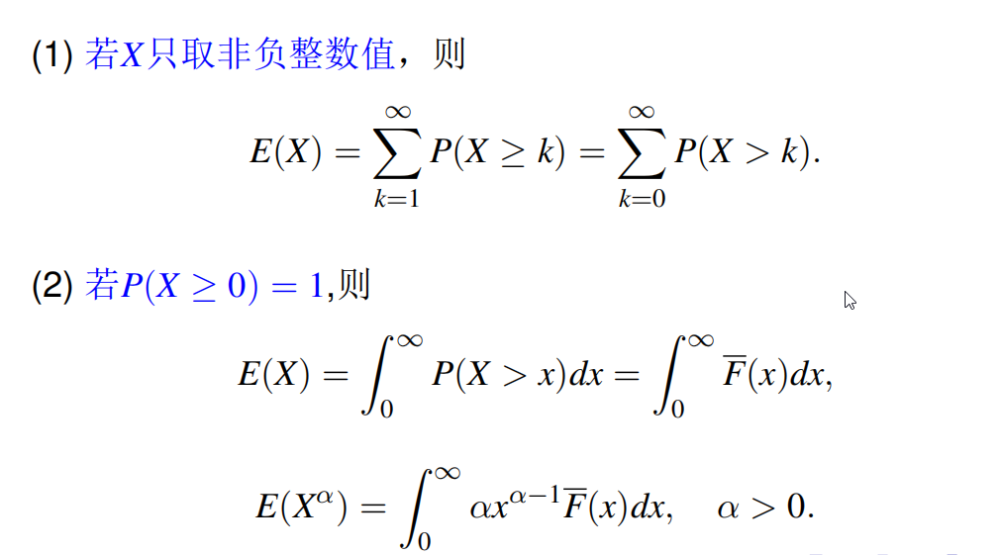
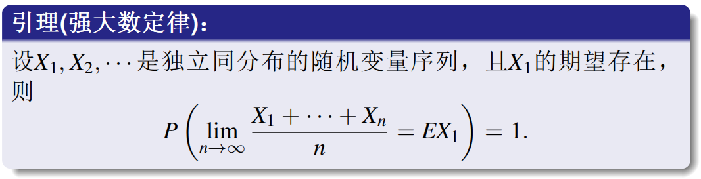
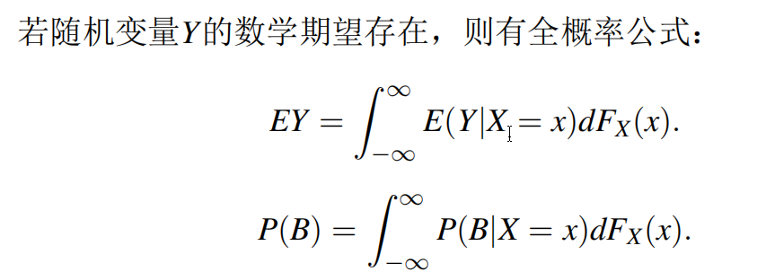
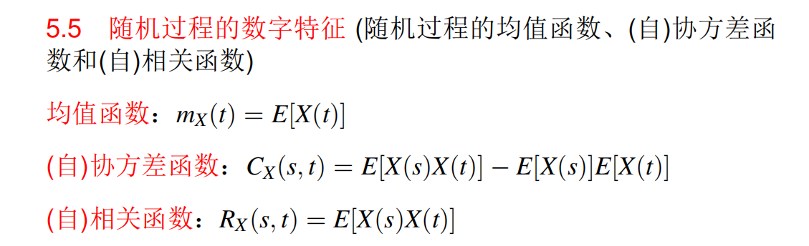
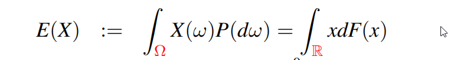
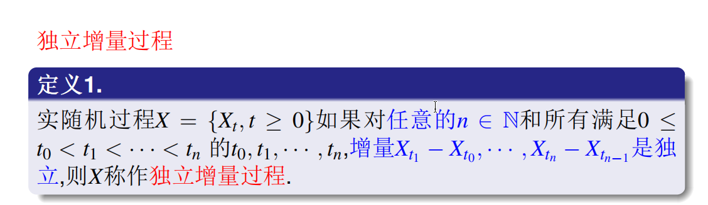
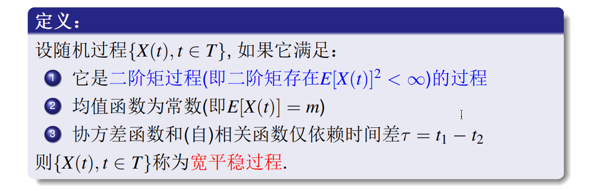
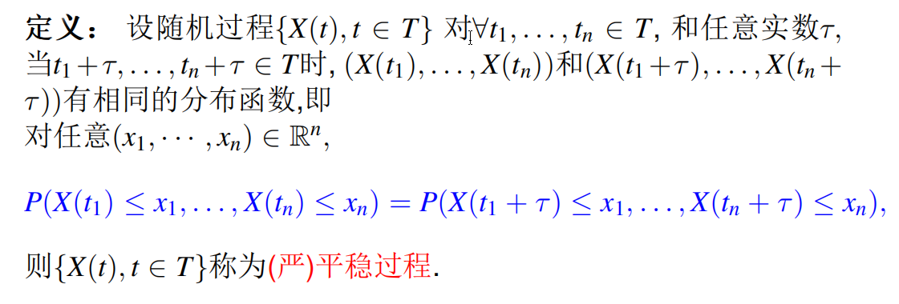
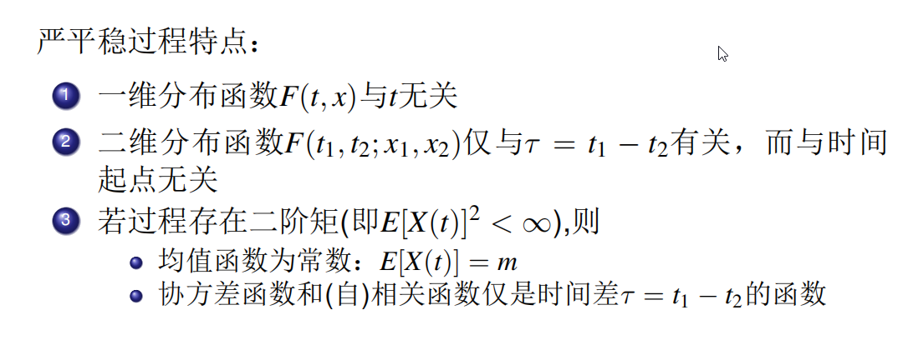

***
注意：
1. 
$$\sum_{i=0}^{n} C_n^i = 2^n$$
2. $$E_i X = \sum_{k=1}^{\infty} P_i(X \geq k)$$

***
## 1.1 生存函数的定义

***
## 1.2 期望的另一种算法

***
## 1.3 强大数律

***
## 1.4 全概率公式

如果 X 是连续型随机变量$$dF_X(x) = F_X'(x)dx = f(x)dx$$
$$P(B) = \int_{-\infty}^{\infty} P(B|X=x)f(x)dx$$
如果 X 是离散型随机变量$$P(B) = \sum_{i} P(B|X=x_i) P(X=x_i)$$
***
## 1.5 一些公式

$$Var(X) = E[X^2] - (E[X])^2$$
***

## 1.6 独立增量过程

***
## 1.7 宽平稳过程

## 1.8 严平稳过程

***
## 1.9 重期望公式
$$E[Y] = E\big[ E[Y|X] \big]$$
例子：
根据示性函数相乘的性质（只有两条件同时满足才为 1）：

$$R(t_1, t_2) = E\big[ I_{\{B(t_1) \ge x\}} I_{\{B(t_2) \ge x\}} \big] = P\big(B(t_1) \ge x, B(t_2) \ge x\big)$$

引入条件期望（固定 $t_1$ 时刻的状态 $B(t_1)$）：

$$R(t_1, t_2) = E\Big[ E\big[ I_{\{B(t_1) \ge x\}} I_{\{B(t_2) \ge x\}} \;\big|\; B(t_1) \big] \Big]$$

#### Step 2: 提取已知状态，剥离独立增量

令内层条件已知 $B(t_1) = y$。此时 $I_{\{B(t_1) \ge x\}}$ 退化为确定性常数 $I_{\{y \ge x\}}$ 可提到外层：

$$\begin{aligned} E\big[ I_{\{B(t_1) \ge x\}} I_{\{B(t_2) \ge x\}} \;\big|\; B(t_1) = y \big] &= I_{\{y \ge x\}} \cdot P\big(B(t_2) \ge x \;\big|\; B(t_1) = y\big) \\ &= I_{\{y \ge x\}} \cdot P\big(B(t_1) + [B(t_2) - B(t_1)] \ge x \;\big|\; B(t_1) = y\big) \\ \end{aligned}$$

根据布朗运动的**独立增量性质**，未来增量 $B(t_2) - B(t_1)$ 与过去状态 $B(t_1)$ 独立，可直接移除条件号：

$$= I_{\{y \ge x\}} \cdot P\big(B(t_2) - B(t_1) \ge x - y\big)$$

#### Step 3: 标准正态化与对称性互换（关键临门一脚）

已知增量 $B(t_2) - B(t_1) \sim N(0, t_2 - t_1)$，对其进行标准化：

$$P\left( \frac{B(t_2) - B(t_1)}{\sqrt{t_2 - t_1}} \ge \frac{x - y}{\sqrt{t_2 - t_1}} \right) = 1 - \Phi\left( \frac{x - y}{\sqrt{t_2 - t_1}} \right)$$

运用 **$\Phi$ 的对称性公式 $1 - \Phi(u) = \Phi(-u)$** 消除前置的 $1-$：

$$1 - \Phi\left( \frac{x - y}{\sqrt{t_2 - t_1}} \right) = \Phi\left( -\frac{x - y}{\sqrt{t_2 - t_1}} \right) = \Phi\left( \frac{y - x}{\sqrt{t_2 - t_1}} \right)$$

#### Step 4: 全概率全空间积分还原

将内层精简后的条件结果放回外层期望，并对 $B(t_1) = y$ 的全空间进行全概率积分。

由于状态算子中存在示性函数 $I_{\{y \ge x\}}$，迫使积分下限缩窄为 $[x, \infty)$：

$$R(t_1, t_2) = \int_{x}^{\infty} \Phi\left( \frac{y - x}{\sqrt{t_2 - t_1}} \right) \cdot f_{B(t_1)}(y) dy$$

代入 $B(t_1) \sim N(0, t_1)$ 的高斯密度函数 $f_{B(t_1)}(y) = \frac{1}{\sqrt{2\pi t_1}} \exp\left(-\frac{y^2}{2t_1}\right)$，得到最终完满的单变量积分式：

$$R(t_1, t_2) = \int_{x}^{\infty} \Phi\left(\frac{y - x}{\sqrt{t_2 - t_1}}\right) \frac{1}{\sqrt{2\pi t_1}} \exp\left(-\frac{y^2}{2t_1}\right) dy$$
