# 泊松过程的定义
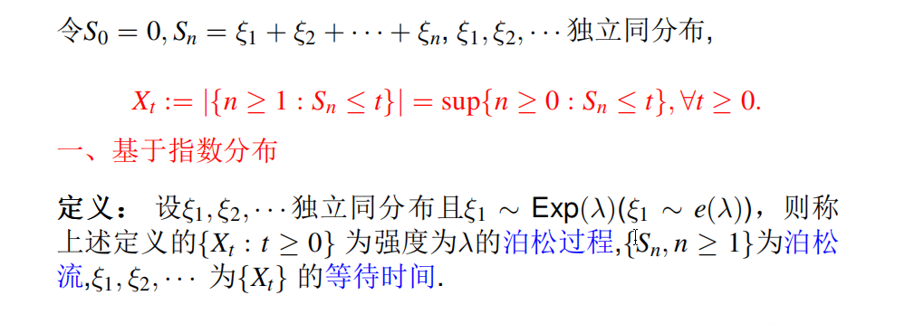
***
# 泊松分布和指数分布的分布律
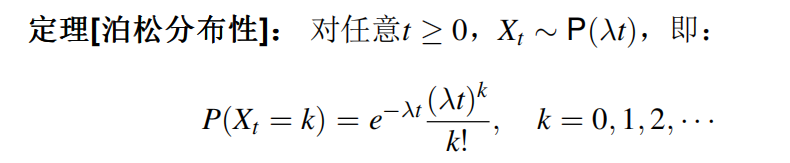
**指数分布的密度函数**
$$f(y) = \begin{cases} \lambda e^{-\lambda y}, & y \ge 0 \\ 0, & y < 0 \end{cases}$$$$P(X > t) = e^{-\lambda t} \quad (t \ge 0)$$
注意，泊松分布的均值为参数$\lambda t$,方差为$\lambda t$
       指数分布的均值为参数$1/\lambda$,方差为$1/\lambda^2$
***
# 泊松过程的数字特征

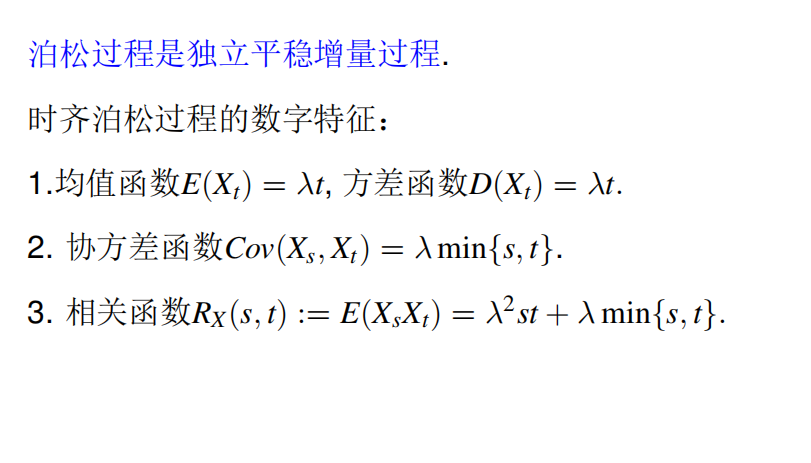
***
# 泊松流的细分和合并
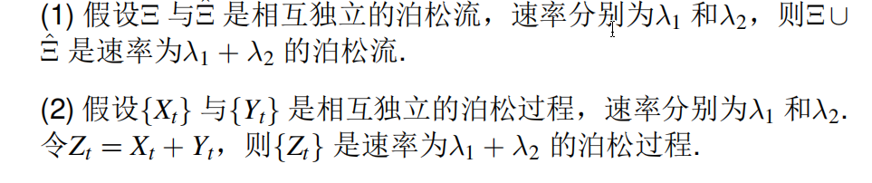
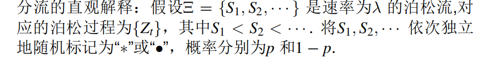

***
# 复合泊松过程
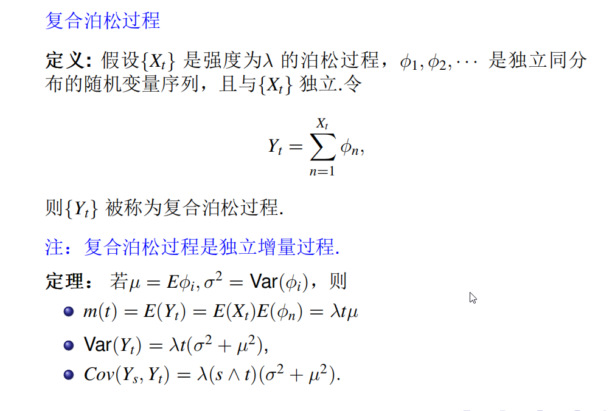

***
# 跳过程的定义
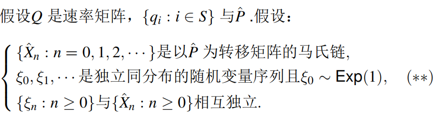
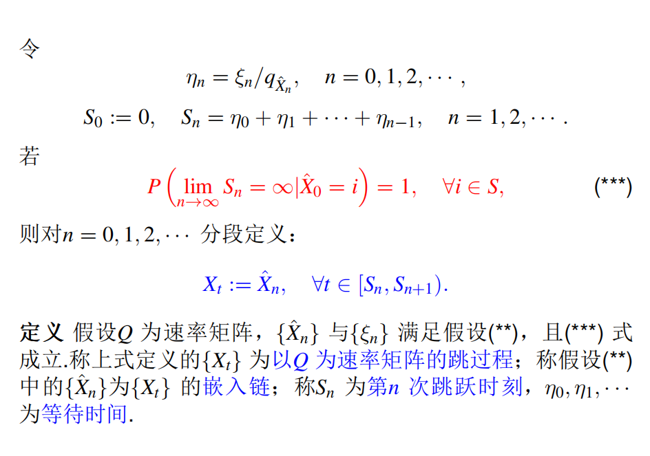
***
# 纯生过程
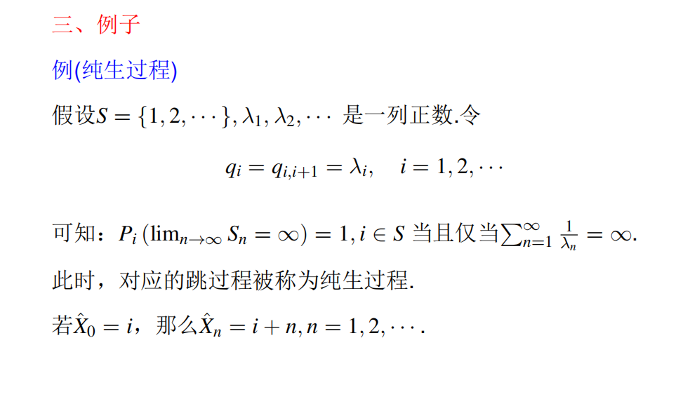
***
# 排队模型
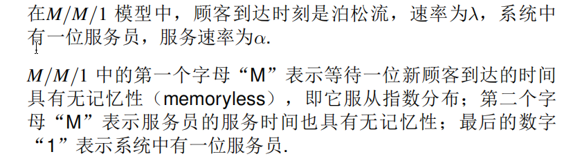
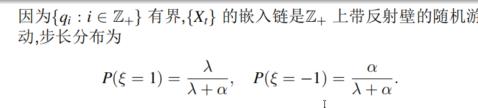
***
# 转移速率
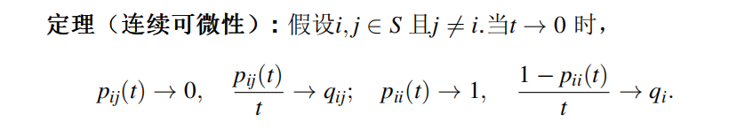
因此算Q时候，Q=P‘（0）
***
# CK方程
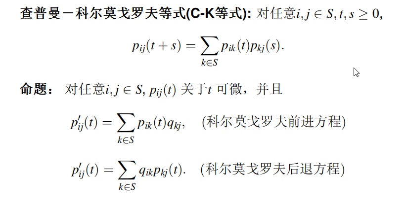
***
# 跳过程常返的定义
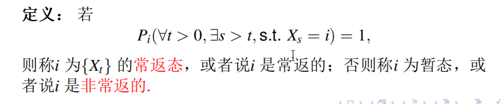
***
# 跳过程的格林函数
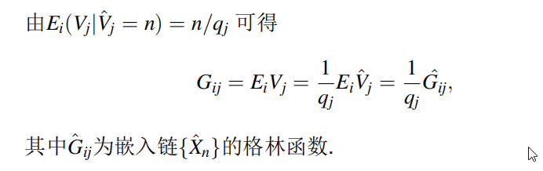
***
# 跳过程的访问频率
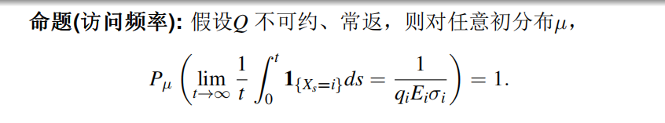
