***
# 不变测度和不变分布

***

# 访问频率

***
# 闭集

闭集就是C里面的点到C外面的概率为0
***
# 不可约
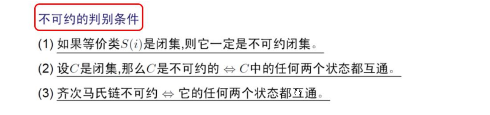
***
# 反射原理

注意：
$$P(\text{憋到最后才第1次到 } i) = \frac{i}{n} \times P(\text{最后不管怎样刚好在 } i)$$
***
# 一维简单随机游动是零常返的

***
# 强马氏性

***
# 回访时间

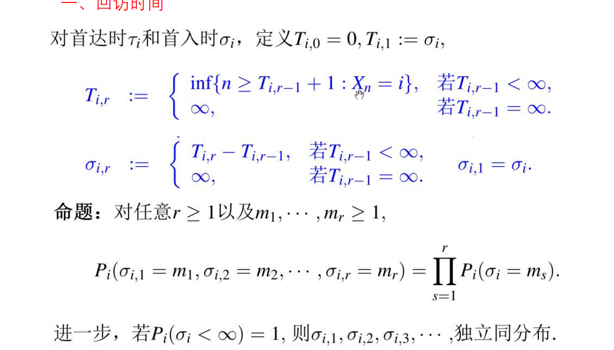
***
# 回访总次数
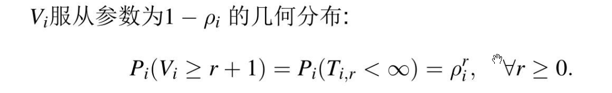
注意：Vi是访问i的总次数，如果马氏链从i出发，回访总次数为Vi-1
***
# 游弋的定义
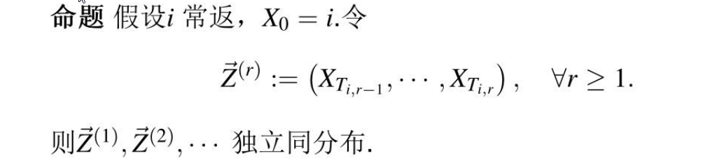

这个Z（n）就是从i出发的游弋。
***
# i常返且i->j，则j->i且j常返
不可约有限闭集是正常返的互通类
***
# 常返类是闭集

如果互通类C不是闭集，那么存在i属于C，j不属于C，i可达j，又因为j不可达i（因为j不属于C），故$P_j(\tau_i < \infty) = P_j(V_i = \infty) = 0$，故i不常返。
***
# 击中概率

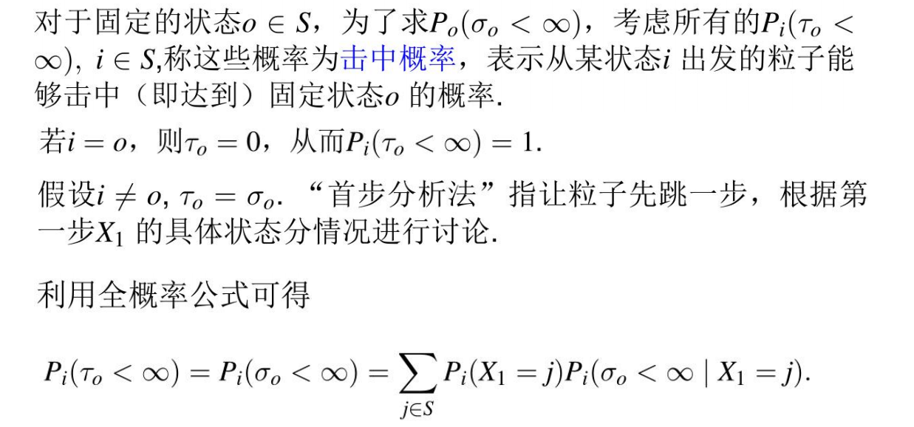
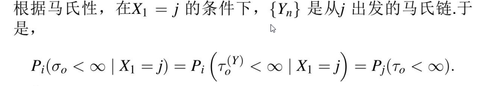
***
# 击中概率与判别常返
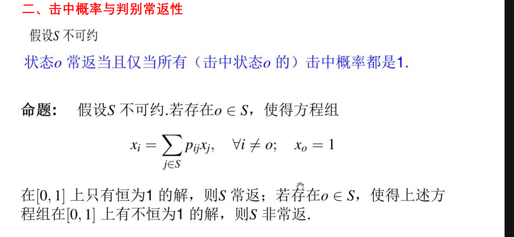
要证明S非常返就是要找一个解xi ！=1 满足上述方程
***
# 吸收态的定义
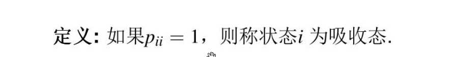
***
# CK方程
$$P_{ij}^{(n)} = \sum_{k} P_{ik}^{(m)} P_{kj}^{(n-m)}$$
***
# 格林函数

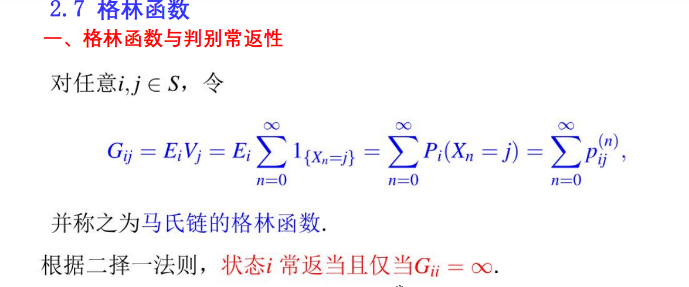

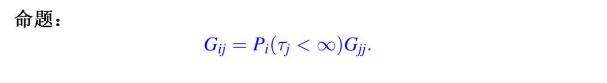
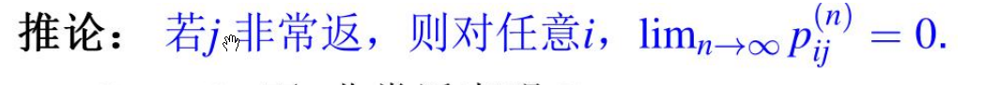
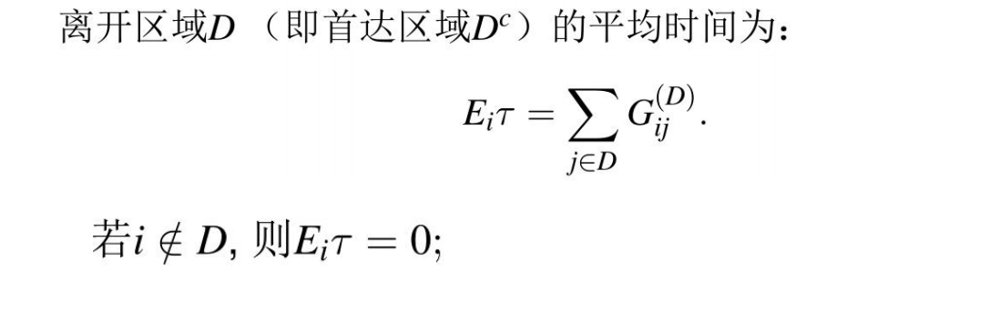
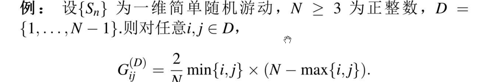
***
# 瓦尔德等式
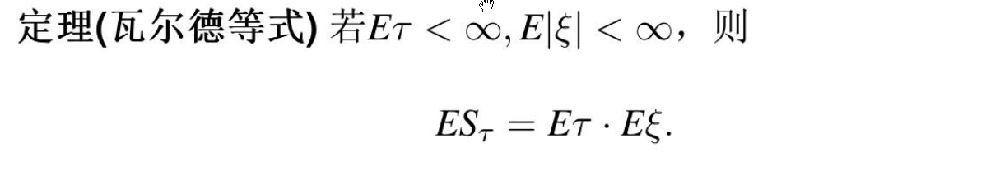
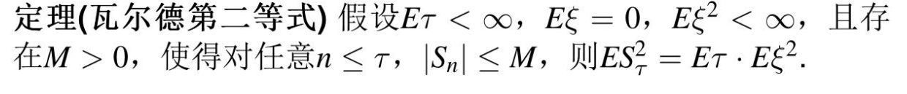
***
# 遍历定理
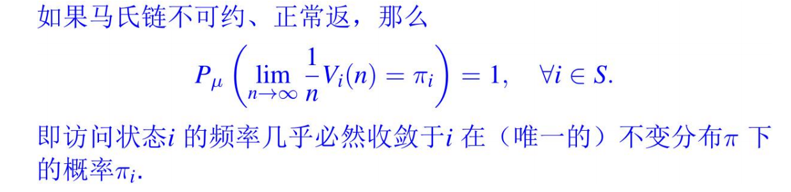

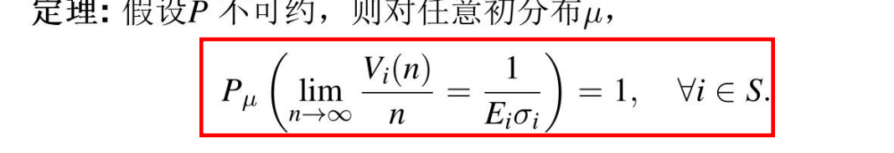
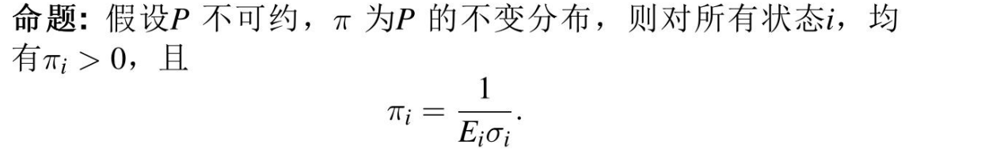
***
# 正常返与不变分布

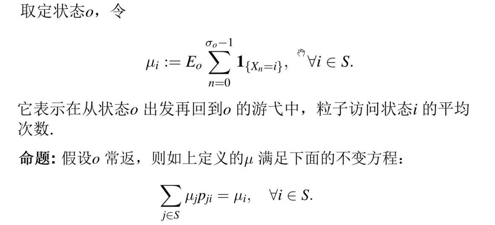
***
# 正常返不可约就存在不变分布
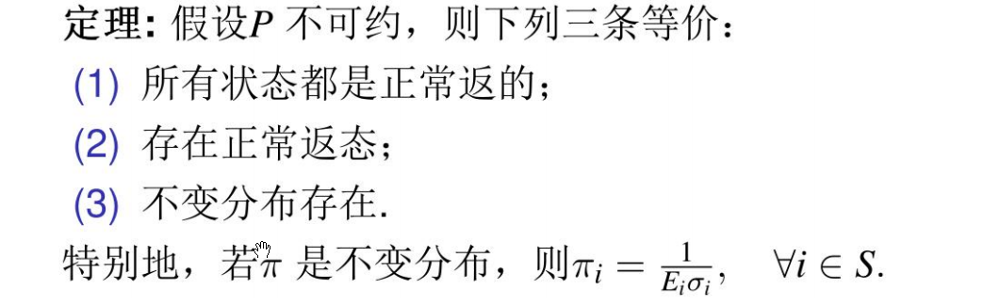
***
# 遍历定理
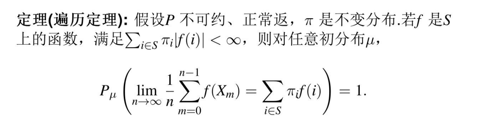
注意：时间平均等于空间平均。（左边为具体的一条轨道，在每个状态作用$f$后的平均取值。
***
# 非周期的定义
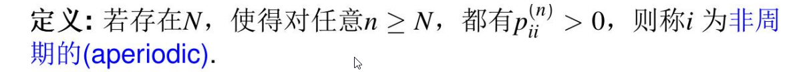

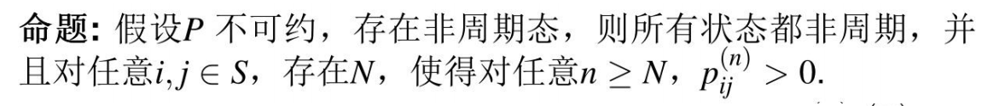
注：不可约的状态空间只要有非周期态，所有状态都是非周期。
***
# 强遍历定理

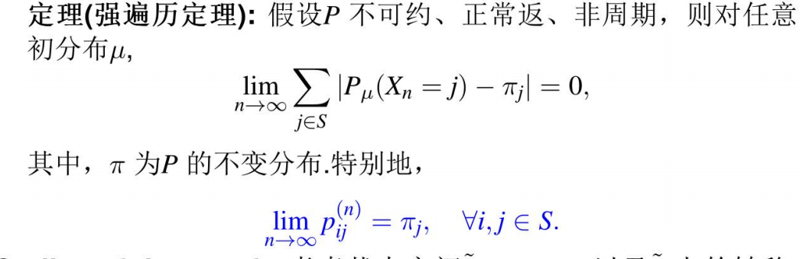