# 特征函数
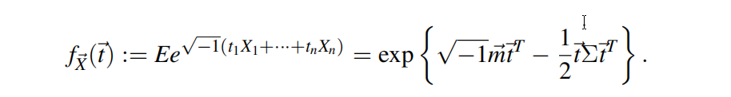
注意：$X服从N（0，1），则特征函数为E[e^{itX}] = e^{-t^2/2}$

# 高斯过程的定义
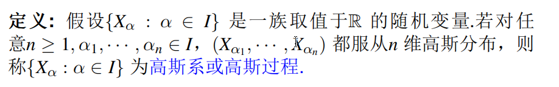
注意：称取值于实数域 $\mathbb{R}$ 的随机变量族 $\{X_t : t \in I\}$ 为一个**高斯过程**（或高斯系），如果它满足：

> **对于任意正整数 $n \ge 1$ 以及任意选择的有限个指数点 $t_1, t_2, \cdots, t_n \in I$，其对应的联合随机向量：**
> 
> $$\vec{X} = (X_{t_1}, X_{t_2}, \cdots, X_{t_n})$$
> **都服从 $n$ 维多元高斯分布（多元正态分布）。**

相互独立的一维正态分布的线性组合还是正态分布
***
# 布朗运动的定义
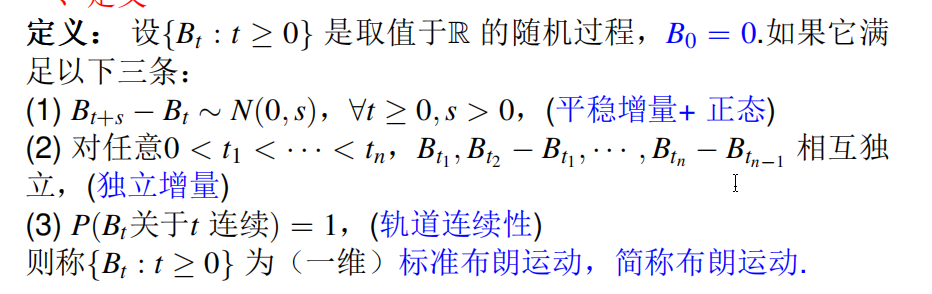
***
# 如何验证一个随机过程是不是标准布朗运动
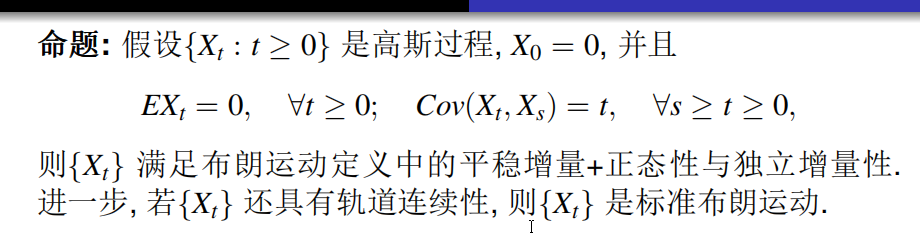
（1）验证随机过程是一个高斯过程（任意有限维分布是联合多元正态分布）
（2）$E[X_t] = 0$ 对任意的t大于等于0
（3）$Cov(X_t,X_s) = min(t,s)$
（4）{Xt}具有轨道连续性
***
# 布朗运动首达时密度函数

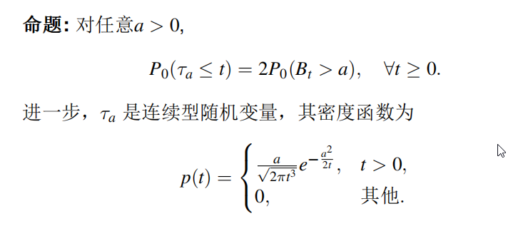
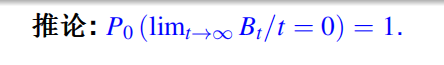
Lt指（0，t）最后一个零点
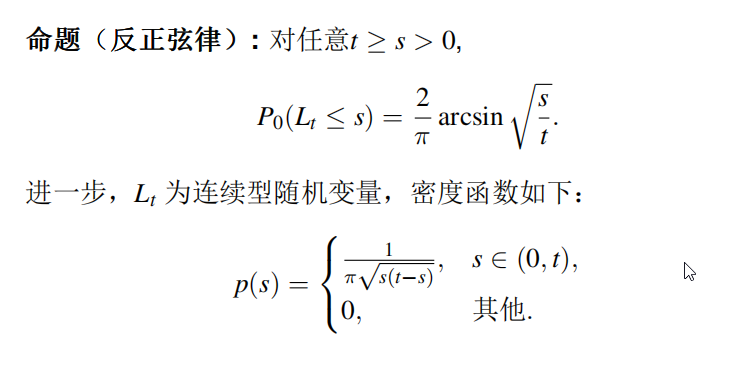
***
# 布朗桥的定义
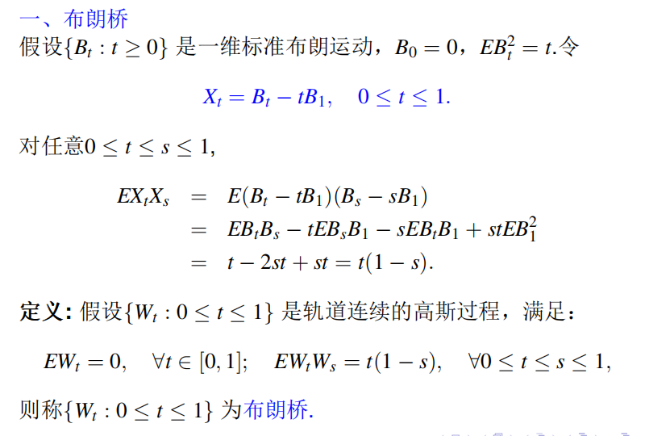
长度为T的布朗桥
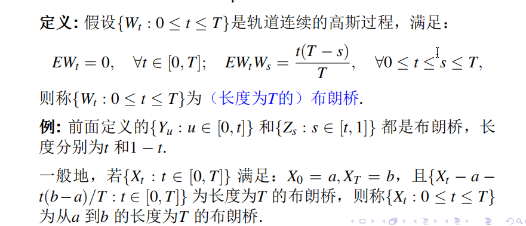
***
# OU过程
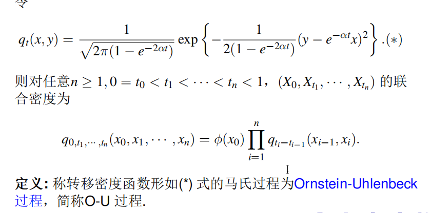
***
# 伊藤公式
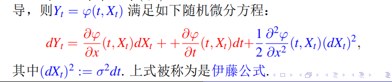
